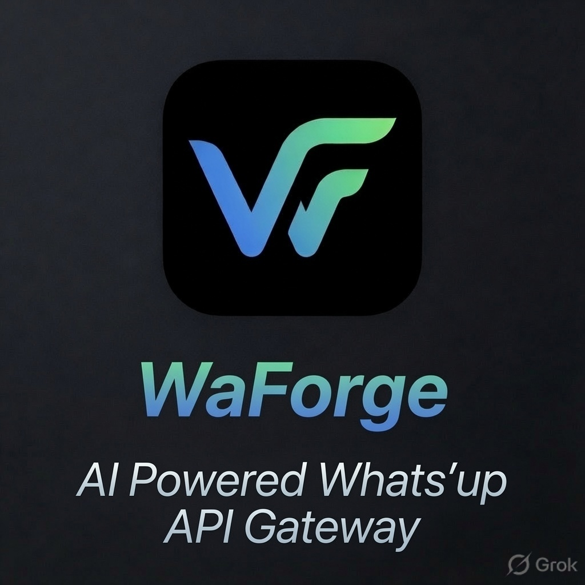
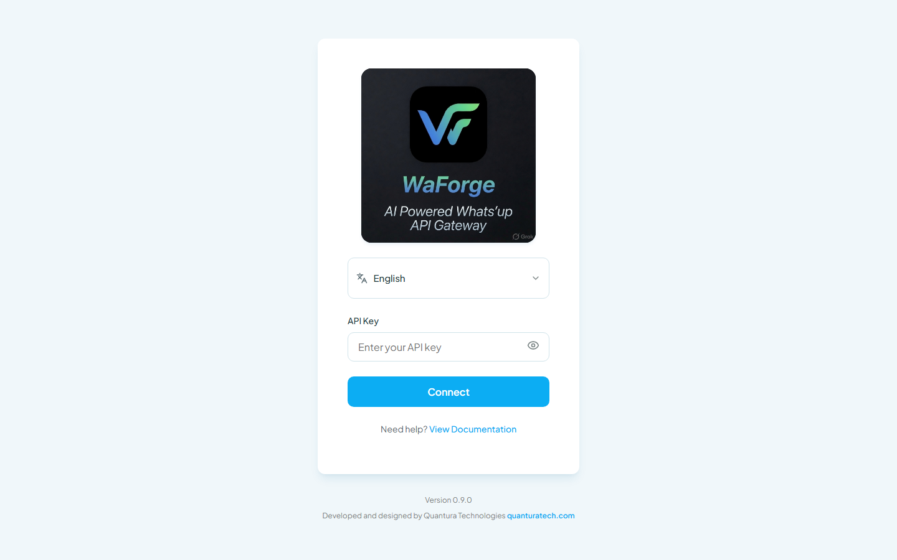
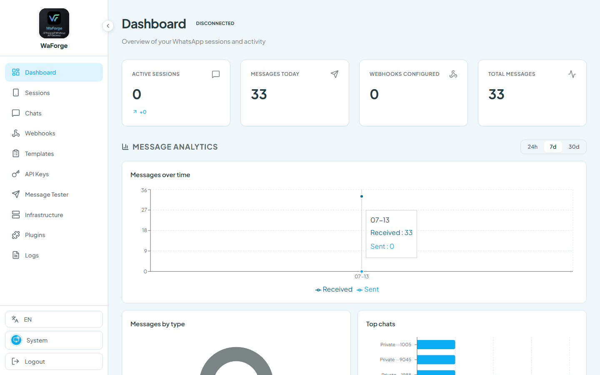
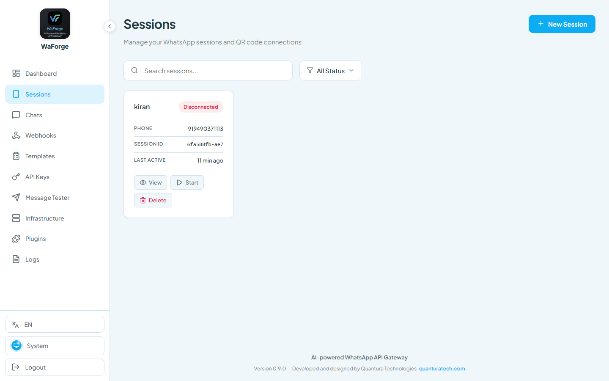
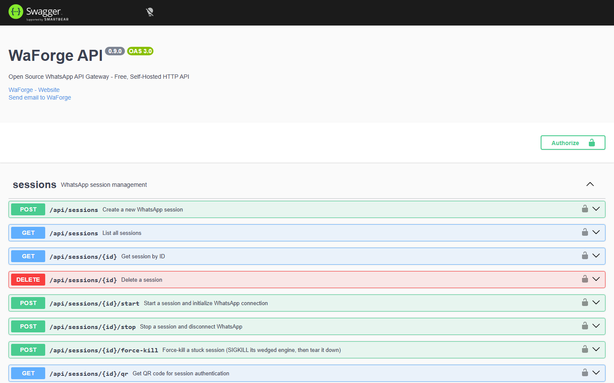

<p align="center">
  
</p>

<h1 align="center">WaForge</h1>

<p align="center">
  <strong>AI-powered self-hosted WhatsApp API Gateway</strong><br/>
  Multi-session REST · Webhooks · MCP agent tools · Dashboard · BYO LLM auto-reply
</p>

<p align="center">
  <a href="https://www.quanturatech.com">Quantura Technologies</a> ·
  <a href="./LICENSE">MIT License</a> ·
  <a href="./docs/README.md">Documentation</a>
</p>

<p align="center">
  
  
  
  
  
</p>

---

## What is WaForge?

WaForge is a self-hosted gateway that turns WhatsApp into a programmable platform for your backend, automations, and AI agents. Run multiple sessions on your own infrastructure, drive them over REST or MCP, push events with webhooks, and operate everything from a web dashboard.

Developed and designed by **[Quantura Technologies](https://www.quanturatech.com)**.

## Features

| Area | Capabilities |
|------|----------------|
| **Multi-session API** | Create, start, stop, and manage many WhatsApp sessions |
| **REST** | Messages, contacts, groups, media, webhooks, stats, and more — OpenAPI/Swagger at `/api/docs` |
| **Webhooks** | Signed delivery of inbound events to your systems |
| **MCP agent tools** | Opt-in Model Context Protocol server at `POST /mcp` for AI assistants (read-only by default) |
| **Dashboard** | Sessions, chats, webhooks, API keys, plugins, infrastructure settings |
| **BYO LLM auto-reply** | OpenAI, Anthropic, Grok, or Gemini — your keys, your models |
| **Group keyword cleanup** | Auto-delete matching group messages when the session is a group admin |
| **Engines** | `whatsapp-web.js` (Chromium) or Baileys (WebSocket, no browser) |
| **Docker** | Production-oriented Compose stack with hardened defaults |

## Quick start (local)

Requirements: **Node.js 22+**, npm.

```bash
git clone https://github.com/quanturatch/waforge.git
cd waforge

cp .env.example .env
# For local dashboard login with the well-known key:
# ALLOW_DEV_API_KEY=true   →  API key: dev-admin-key

# If peer dependency resolution fails on your npm version:
npm install --legacy-peer-deps
# otherwise:
npm install

npm run dev
```

`npm run dev` starts the Nest API and the Vite dashboard together.

| Service | URL |
|---------|-----|
| API | http://localhost:2785 |
| Swagger | http://localhost:2785/api/docs |
| Health | http://localhost:2785/api/health |
| MCP | `POST` http://localhost:2785/mcp |
| Dashboard (Vite) | http://localhost:2886 |

**Dashboard login:** with `ALLOW_DEV_API_KEY=true` in `.env`, use API key `dev-admin-key`. Without that flag, a random admin key is generated on first boot (see the startup banner / `data/.api-key`).

Minimal SQLite-only setup is also available via `.env.minimal` — see [docs/README.md](./docs/README.md).

## Screenshots

| Dashboard login | Main dashboard |
|-----------------|----------------|
|  |  |

| Sessions | Swagger API docs |
|----------|------------------|
|  |  |

Regenerate after `npm run dev` with `node scripts/capture-screenshots.mjs` (Playwright Chromium).

## Configuration highlights

Copy `.env.example` → `.env`. Full reference lives in that file; common knobs:

### Engines

```env
# ENGINE_TYPE=whatsapp-web.js   # default path (Chromium per session)
# ENGINE_TYPE=baileys           # lighter WebSocket client, no Chromium
```

### AI auto-reply (BYO LLM)

Dashboard → **Infrastructure → AI Auto-Reply**, or env:

```env
AI_AUTO_REPLY_ENABLED=true
AI_PROVIDER=openai          # openai | anthropic | grok | gemini
AI_API_KEY=sk-...
# AI_MODEL=
# AI_SYSTEM_PROMPT=
# AI_REPLY_TO_GROUPS=false
```

### MCP (agent tools)

```env
MCP_ENABLED=true
MCP_READONLY=true           # recommended for observer agents
```

Authenticate with header `X-API-Key`. Details: [docs/24-mcp-integration.md](./docs/24-mcp-integration.md).

### Group keyword cleanup

```env
GROUP_CLEANUP_ENABLED=true
GROUP_CLEANUP_KEYWORDS=happy birthday,hbd,birthady
GROUP_CLEANUP_REQUIRE_ADMIN=true
```

### Security

```env
# ALLOW_DEV_API_KEY=true     # local only — seeds dev-admin-key
# API_MASTER_KEY=            # optional master key
ENABLE_SWAGGER=true
```

## Docker

Production-style Compose (API, optional datastores, socket proxy):

```bash
docker compose up -d --build
```

Dev-oriented Compose is in `docker-compose.dev.yml`. Image build uses the root `Dockerfile`. See [docs/10-devops-infrastructure.md](./docs/10-devops-infrastructure.md) and [docs/28-gcp-cloud-run.md](./docs/28-gcp-cloud-run.md).

## Documentation

| Doc | Description |
|-----|-------------|
| [docs/README.md](./docs/README.md) | Full documentation index |
| [01 — Project overview](./docs/01-project-overview.md) | Vision, scope, values |
| [03 — Architecture](./docs/03-system-architecture.md) | Modules and runtime flows |
| [06 — API specification](./docs/06-api-specification.md) | REST and WebSocket |
| [24 — MCP integration](./docs/24-mcp-integration.md) | Agent tools and auth |
| [22 — n8n](./docs/22-n8n-integration.md) | n8n workflows |
| [AGENTS.md](./AGENTS.md) | Instructions for AI coding agents |

## Project layout

```
WaForge/
├── src/                 # NestJS API (sessions, messages, webhooks, MCP, …)
├── dashboard/           # React + Vite operator UI
├── docs/                # Specs, runbooks, examples
├── scripts/             # Backup, smoke tests, OpenAPI export
├── docker-compose.yml   # Production-oriented stack
├── .env.example         # Configuration reference
└── AGENTS.md            # Agent-oriented project guide
```

## License

[MIT](./LICENSE)

---

<p align="center">
  Built by <a href="https://www.quanturatech.com">Quantura Technologies</a>
</p>
